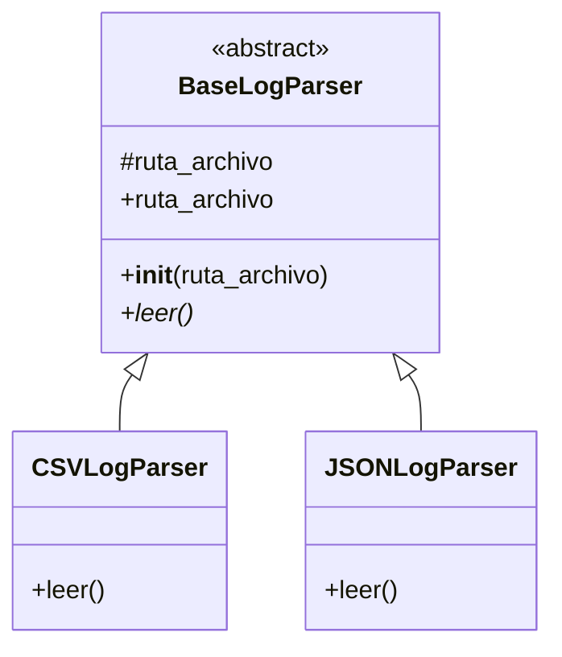

```mermaid
classDiagram

    class BaseLogParser {
        <<abstract>>
        #ruta_archivo
        +__init__(ruta_archivo)
        +ruta_archivo
        +leer()*
    }

    class CSVLogParser {
        +leer()
    }

    class JSONLogParser {
        +leer()
    }

    BaseLogParser <|-- CSVLogParser
    BaseLogParser <|-- JSONLogParser
```

